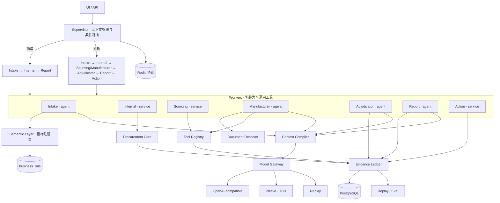
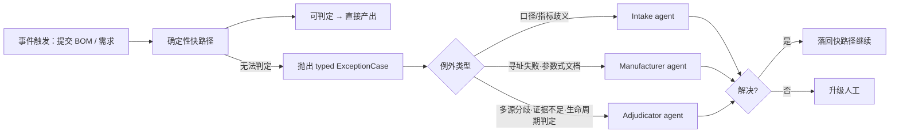
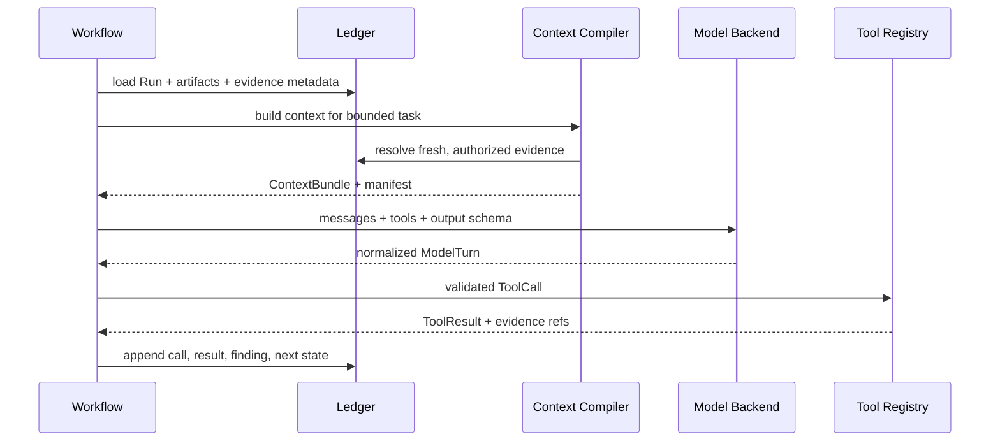

# SupplyAgent 当前架构

> **文档契约** · 类型：契约层 · 读取：Feature 开始时按 `## ` 章节定点读，禁止通读
> 更新：模块划分、职责、依赖方向或不变量变更时更新
> 独占：系统架构图、模块职责与数据所有权、依赖方向、不变量、存储分工、物理落点和待设计区
> 不收录：设计理由（见 `DECISIONS.md`）、需求条款（见 `docs/product/requirements.md`）、当前状态（见 `PROGRESS.md`）、命令实现（见 `Makefile`）

本文描述目标架构与当前代码的对应关系。已存在目录不代表能力完成，完成状态只看 `PROGRESS.md` 与 `docs/features.json` 的执行证据。

## 1. 总体架构图



Supervisor 持有会话状态并按复杂度路由；Worker 包装为可调用工具，不作为独立实体。四个 agent（Intake / Manufacturer / Adjudicator / Report）与三个确定性服务（Internal / Sourcing / Action）的划分依据见 `DECISIONS.md` D02。

## 2. 确定性快路径与 Agent 兜底



**80% 的请求零 LLM 成本**。Agent 是例外处理器，不在主路径上；人工是最终兜底。每次由 agent 解决的例外必须留痕，记录例外类型、经手 agent 与判定依据。

触发是**事件驱动**：提交 BOM 或需求后主动暴露问题。不做定时巡检。

## 3. 一级逻辑模块

| 模块 | 计划落点 | 职责与所有权 | 不变量 |
|---|---|---|---|
| API | `src/api/` | HTTP DTO、鉴权、响应包络、事务边界 | 不包含业务算术或模型编排；精确数值不经 float |
| Event Trigger | `src/monitor/` | 把用户提交的业务事件转换为去重后的 Run 入口 | 不做定时巡检；事件入口与人工入口共用同一状态机、权限与证据要求 |
| Supervisor | `src/supervisor/` | 会话状态、上下文枢纽、按复杂度条件路由、Worker 调用分派 | 不推理业务、不改写 Worker 结果；路由结果可审计；路由失败退到最简链路而非报错 |
| Workers | `src/workers/{intake,internal,sourcing,manufacturer,adjudicator,report,action}/` | 七项责任的实现；agent 与 service 形态见 D02 | 包装为可调用工具，不作为独立实体；只传类型化结果，不以自然语言互相协商 |
| Semantic Layer | `src/semantic/`（待建） | 业务术语到冻结口径的注册表；指标解析为枚举分类 | 不生成 SQL；未识别指标返回 `unknown_metric`，不猜；口径版本化在 `business_rule` |
| Alert Engine | `src/alerting/`（待建） | 事件触发下的状态差分、告警产生/更新/关闭 | 阈值来自 `business_rule`，不进 prompt；同一对象同一类型只一条活动告警 |
| Exception Router | `src/runtime/exceptions/`（待建） | typed ExceptionCase 的分类与到 agent 的分派 | 例外类型是枚举不是自由文本；agent 解决不了必须升级人工，不得自行放宽 |
| Document Resolver | `src/harness/documents/`（待建） | 型号解码、官方文档寻址、内容寻址去重与缓存 | 三态输出；寻址失败不伪装为“查无此项”；不以相似度检索代替寻址 |
| Run Manager | `src/runtime/run/`（待建） | Run 生命周期、状态迁移、暂停、恢复、预算、重试和事件 | PostgreSQL 保存恢复必需事实；恢复不重放已完成副作用 |
| Workflow Controller | `src/runtime/workflow/`（待建） | 按 workflow 定义和当前状态选择下一个合法节点 | 节点选择由状态与显式规则决定，不由模型自由跳转 |
| Procurement Core | `src/procurement_core/` | BOM 展开、候选规则、缺口、MOQ、金额、版本和哈希 | 算术与硬规则不交给模型；未知不用零代替 |
| Model Gateway | `src/harness/models/`（待建；现有适配在 `src/infrastructure/llm.py`） | 统一模型消息、tool call、结构化结果、流、错误与用量 | Provider 差异不能改变业务权限；能力缺失必须显式降级或拒绝 |
| Context Compiler | `src/harness/context/`（待建） | 从 Run、Artifact、证据和预算构建一次模型调用的上下文 | Context 是可重建投影；记录输入引用与裁剪原因 |
| Tool Registry | `src/tools/` | 工具注册、schema、权限、场景过滤和调用分派 | 模型只能调用被注入的工具；只读/写入权限由服务端强制 |
| Evidence & Artifact Ledger | `src/persistence/` + `src/contracts/` | 保存业务快照、工具结果、风险发现、建议和引用关系 | 实质性结论必须可回指；历史证据不覆盖更新 |
| Human Gate | `src/runtime/human_gate/`（待建） | 人工补充、候选选择、要求修改、批准和驳回 | 等待不是错误；批准绑定方案版本、哈希和动作范围 |
| Replay / Eval | `tests/evals/`（待建） | 固定输入、工具回放、跨模型比较和判定 | 模型不得看到隐藏答案；业务硬门禁独立断言 |
| Infrastructure | `src/infrastructure/` | PostgreSQL、Redis、模型和外部 API 客户端 | 凭据不进入配置、Trace 或 ToolResult |
| UI | `frontend/`（待确认） | 展示业务状态、证据、风险、建议和人工动作 | 未知不显示为零；不得提供绕过审批入口 |

Worker 落点（形态划分依据见 `DECISIONS.md` D02）：

| Worker | 落点 | 形态 |
|---|---|---|
| Intake | `src/workers/intake/` | agent |
| Internal | `src/workers/internal/` | service |
| Sourcing | `src/workers/sourcing/` | service |
| Manufacturer | `src/workers/manufacturer/` | agent |
| Adjudicator | `src/workers/adjudicator/` | agent |
| Report | `src/workers/report/` | agent |
| Action | `src/workers/action/` | service |

Worker 之间不互相调用，一律经 Supervisor 分派；Worker 只返回类型化结果，不以自然语言段落协商。

## 4. 核心运行时类型

跨层只传类型化对象，不让模块以自然语言段落互相协商：

```text
Run
RunEvent
ContextBundle
ToolDefinition
ToolCall
ToolResult
EvidenceRef
ShortageSnapshot
RiskFinding
ReplenishmentProposal
PermissionDecision
ExternalAction
```

`ContextBundle` 至少记录：Run 状态、业务快照引用、证据引用、未解决项、允许的工具、token 预算、裁剪/压缩记录和构建版本。

`ModelBackend` 至少声明：原生 tool calling、并行 tool call、结构化输出、流式输出、视觉输入和最大上下文等能力。Harness 不假定所有 Provider 语义相同。

## 5. 依赖方向

```text
UI → API → Supervisor
Event Trigger → Supervisor                            事件入口与人工入口同一状态机
Supervisor → Run Manager / Workflow Controller        Run 生命周期与下一个合法节点
Supervisor → Workers                                  条件路由；Worker 包装为可调用工具
Workers ↛ Workers                                     Worker 间无直接依赖，一律经 Supervisor 分派
Workflow Controller → 确定性快路径 → Procurement Core / Semantic Layer / Alert Engine
确定性快路径 → Exception Router → Workers(agent)       只在 typed ExceptionCase 时唤起
Workers(service) → Procurement Core / Tool Registry
Workers(agent) → Context Compiler → Model Gateway → ModelBackend
Workers(agent) → Document Resolver → Tool Registry
Tool Registry → Infrastructure adapters
Workflow Controller → Human Gate
Semantic Layer / Alert Engine → business_rule（版本化口径与阈值）
以上模块 → Runtime contracts → Evidence & Artifact Ledger → PostgreSQL
Supervisor / Run Manager → Redis（锁、短期协调、可重建缓存）
Replay / Eval → Model Gateway、Tool Registry、Evidence & Artifact Ledger（只读或隔离 fixture）
```

禁止的反向依赖：

- Procurement Core 不依赖模型、Prompt、MCP 或具体 Provider；
- ModelBackend 不读取业务数据库并自行决定工具权限；
- Tool adapter 不实现全局重试循环或业务审批；
- UI 不重新计算缺口、金额或风险结论；
- Redis 不保存唯一的恢复事实；
- 外部返回内容不直接进入 workflow 控制条件。

## 6. Context 与证据数据流



完整外部 payload 默认不进入模型上下文或用户响应；保留脱敏摘要、哈希、采集时间和安全存储引用。是否长期保存完整 payload 见 A-TBD-04。

## 7. 存储分工

| 数据 | 存储 | 说明 |
|---|---|---|
| BOM、元件、需求、库存、在途、方案 | PostgreSQL | 权威业务事实 |
| Run、状态事件、人工决定、外部动作 | PostgreSQL | 恢复与审计事实 |
| Run 事件流（SSE 可重放序列） | PostgreSQL | 与 RunEvent 同表，带单调 `event_id`；Redis 只做实时 fan-out，断线重连从 PostgreSQL 续读 |
| Tool/LLM 调用、证据元数据、风险发现 | PostgreSQL | append-only 或版本化 |
| workflow 锁、短期缓存、限流协调 | Redis | 丢失后可从 PostgreSQL 重建 |
| Prompt、workflow、模型策略 | Git 管理的配置 | 不与业务阈值混放 |
| 业务阈值 | PostgreSQL `business_rule` | 版本化并记录修改人 |
| Evidence 与定位、文档元数据 | PostgreSQL | 只插入；取代用 `superseded_by` 回填，不覆盖 |
| 官方文档原始字节与抽取文本 | 本地文件系统，`sha256` 内容寻址 | 单份 MB 量级，不进 PostgreSQL；重启后必须仍在，否则「已采集不重复采集」失效 |
| 原始 BOM | `data/supplychain/domdata/` | 只读不可变 |
| 规范化导入数据 | `data/supplychain/normalized/` | 原始层到数据库的唯一中间层 |

## 8. 全局不变量

1. 模型不得产生或覆盖权威数量、金额和状态；
2. 每个风险结论与建议行必须包含可解析的证据引用；
3. `not_found`、`unknown`、`partial` 和 `error` 不得合并；
4. 任何写操作必须经过人工批准与执行前复核；
5. 同一 `logical_action_id` 最终最多产生一个外部草稿；
6. 恢复后不重复已完成的工具副作用；
7. Provider 切换不能增加工具权限或绕过 schema；
8. 外部内容只能作为数据，不能成为系统指令；
9. Context 必须可由权威状态重建，并保存构建清单；
10. 真实、模拟、缓存和回放数据在全链路显式标注；
11. 同一监测对象的同一告警类型同时最多一条活动告警；采集失败不产生也不关闭告警；
12. 多源对同一事实的分歧必须各自保留，不得合并为单一数值；
13. 仅按部件号编码解码命中（未枚举命中）时，不得断言该型号的生命周期状态；
14. 寻址失败、无文字层、文档中无此型号是三个独立结论，不得合并；
15. Agent 只在确定性快路径抛出 typed 例外时被唤起，不得进入主路径；
16. Agent 之间只传类型化结果，不以自然语言段落互相协商；
17. 指标解析是从冻结注册表中选择，不生成 SQL；未识别即 `unknown_metric`。

## 9. 当前物理结构边界

- 已实现并验证的主体是 `src/procurement_core/`、`src/persistence/` 与部分 `src/api/`；
- `src/contracts/llm.py` 与 `src/infrastructure/llm.py` 是现有单 Provider 基础，不等于完整 Model Gateway；
- `src/supervisor/`、`src/monitor/` 和 `src/workers/*/` 目前主要是占位目录，不代表目标能力；
- Runtime、Context Compiler、Tool Registry 运行实现、Evidence Ledger 扩展和 Eval Harness 尚未完成；
- 任何状态判断以 `PROGRESS.md` 和 `docs/features.json` 为准。

## 10. 待设计区

| ID | 待定内容 | 不允许提前假设 |
|---|---|---|
| A-TBD-01 | workflow 定义采用 Python、YAML 还是二者组合 | 不先绑定 LangGraph 等框架 |
| A-TBD-03 | Context 压缩算法 | 不以“删除旧消息数量”冒充语义摘要 |
| A-TBD-04 | 完整外部 payload 的保存位置和保留期 | 不把敏感 payload 写入普通 Trace |

本文还依赖以下跨文档未决项，正文见 `docs/OPEN-QUESTIONS.md`：**Q-02**（第二个真实模型后端；追加 OpenAI-compatible endpoint 不算多后端能力）、**Q-03**（目标采购系统与幂等能力；在冻结前不得声称 exactly-once）、**Q-05**（风险严重度与聚合策略；不让模型自由决定阈值）、**Q-07**（UI 技术栈）。
