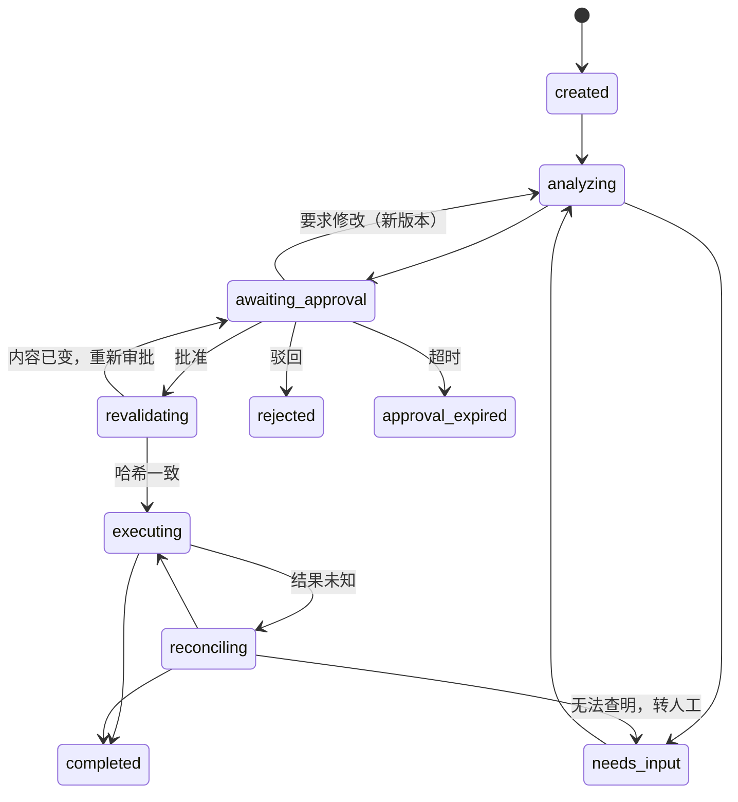

# SupplyAgent 任务状态机

> **文档契约** · 类型：契约层 · 读取：实现状态流转、审批门或恢复逻辑时按状态名定点读，禁止通读
> 更新：状态取值、合法迁移或迁移必备证据变更时由 Claude 写入
> 独占：任务状态取值定义、合法迁移矩阵、每次迁移的必备证据与副作用、状态机不变量
> 不收录：业务规则条款正文（见 `docs/product/requirements.md`）、表结构（见 `docs/spec/data-model.md`）、工具契约（见 `docs/spec/interfaces.md`）、决策理由（见 `DECISIONS.md`）、当前实现状态（见 `PROGRESS.md`）

本文固定 Run（一次可恢复的任务执行）的状态取值与合法迁移。**未在迁移矩阵中出现的迁移一律非法**，实现必须拒绝而非静默接受。状态与审批记录由 PostgreSQL 承担；Redis 可以缓存与协调，不能独自保存恢复所必需的事实（见 EV-25）。

## 1. 状态取值

| 状态 | 类别 | 含义 |
|---|---|---|
| `created` | 活动 | 任务已建，尚未开始分析 |
| `analyzing` | 活动 | 缺料计算、供应查询、候选核验进行中 |
| `needs_input` | 等待 | 缺必要字段、候选歧义或核对无法查明，等人工补充 |
| `awaiting_approval` | 等待 | 方案已生成并版本化，等人工审批 |
| `revalidating` | 活动 | 已批准，执行前重新核对方案内容哈希与业务快照 |
| `executing` | 活动 | 正在向目标业务系统创建采购草稿 |
| `reconciling` | 活动 | 写入结果未知，正在查询核对实际是否已创建 |
| `completed` | **终态** | 草稿已创建并读回核对一致 |
| `rejected` | **终态** | 人工驳回 |
| `approval_expired` | **终态** | 审批超时，未获批准 |
| `failed` | **终态** | 预算耗尽、工具连续失败或核对无法查明且人工放弃 |
| `cancelled` | **终态** | 人工取消 |

终态不可再迁出。**`cancelled` 不等于回滚**：已发出的外部写入即使任务取消仍须完成核对（见 EV-24）。

## 2. 合法迁移矩阵

上图仅供快速定位，**以下表为准**。`failed` 与 `cancelled` 的入边见表末两行，未画入图中以免喧宾夺主。

| 从 | 到 | 触发条件 | 必备证据 | 外部副作用 |
|---|---|---|---|---|
| `created` | `analyzing` | 必填字段齐备，开始处理 | 需求快照（产品版本、数量、需求日期） | 无 |
| `analyzing` | `needs_input` | 缺字段、数量口径未核验（BR-01）、候选未选定（BR-02）或无 MPN | 未解决项清单，逐条带 `evidence_ref` | 无 |
| `analyzing` | `awaiting_approval` | 方案生成完毕并版本化 | 方案内容哈希、版本号、缺口计算明细、报价证据与采集时间 | 无 |
| `needs_input` | `analyzing` | 人工补充字段或选定候选 | 操作人、时间、补充内容；选定候选须留人工确认记录 | 无 |
| `awaiting_approval` | `revalidating` | 人工批准 | `PermissionDecision` 记录：操作人、时间、绑定的方案哈希与动作范围（BR-08） | 无 |
| `awaiting_approval` | `analyzing` | 人工要求修改 | 修改意见；**生成新版本**，旧版本不可复用其审批 | 无 |
| `awaiting_approval` | `rejected` | 人工驳回 | 驳回记录与理由（BR-09） | 无 |
| `awaiting_approval` | `approval_expired` | 超过审批期限 | 超时判定时间与所用期限值（取自 `business_rule`） | 无 |
| `revalidating` | `executing` | 方案哈希与业务快照仍一致 | 复核证据：本次重算的哈希、比对结果、复核时间 | 无 |
| `revalidating` | `awaiting_approval` | 供应商、商品、数量、金额或关键条件已变 | 差异明细；旧批准作废，须重新批准（BR-08、EV-19） | 无 |
| `executing` | `completed` | 草稿创建成功并读回核对一致 | 目标草稿 ID、`logical_action_id`、读回内容比对结果 | **已创建草稿** |
| `executing` | `reconciling` | 写入响应丢失或结果未知 | 已发出的请求记录与 `logical_action_id` | **可能已创建草稿** |
| `reconciling` | `completed` | 按 `logical_action_id` 查到草稿且内容一致 | 核对查询结果、草稿 ID | 草稿已存在 |
| `reconciling` | `executing` | 核对确认未创建，按同一 `logical_action_id` 重试 | 核对结果为 `not_found` 的证据 | 无 |
| `reconciling` | `needs_input` | 无法查明是否已创建 | 核对结果为 `unknown` 的证据（BR-11） | 状态未知，禁止盲目重试 |
| 任一活动态 | `failed` | 预算耗尽、工具连续失败超上限，或人工放弃核对 | 失败原因、所在验证层级、已消耗预算、已发出的外部写入清单 | 视中断点而定 |
| 任一非终态 | `cancelled` | 人工取消 | 取消人、时间；已发出的外部写入仍须核对 | 视中断点而定 |

## 3. 不变量

以下每条都可被独立断言检查，属 `DECISIONS.md` D14 的 ① 静态契约层：

1. **执行前必经复核**：`executing` 的唯一入边是 `revalidating` 与 `reconciling`。不存在从 `analyzing` 或 `awaiting_approval` 直达 `executing` 的路径。
2. **绝不自动批准**：`awaiting_approval` 的所有出边都需要人工动作或超时判定，没有任何条件能让系统自行批准（BR-09）。自动触发的 Run 与用户触发的 Run 走同一条链路，不因来自 Monitor 而豁免（见 `DECISIONS.md` D03）。
3. **审批绑定内容**：`revalidating` 必须重算方案哈希并与 `PermissionDecision` 记录中绑定的哈希比对；不一致必须回到 `awaiting_approval`，不得凭旧批准执行（BR-08）。
4. **终态封闭**：`completed` / `rejected` / `approval_expired` / `failed` / `cancelled` 无出边。需要继续处理时建新 Run，不复活旧 Run。
5. **写入唯一性**：同一 `logical_action_id` 在目标系统中最终只能对应一张草稿。判定以目标系统的记录计数为准，不以本地日志为准（BR-11、EV-22）。
6. **恢复不重放副作用**：从持久状态恢复的 Run 不得重复已完成的外部写入；`executing` 与 `reconciling` 恢复后一律先走核对，不直接重发（FR-09、EV-24）。
7. **权威事实落 PostgreSQL**：状态、版本、审批记录与已发出写入的清单必须在 PostgreSQL 中可查；Redis 清空或不可用时这些事实不得丢失（EV-25）。写入前的必要控制不可用时安全停止，不降级放行。
8. **不重复创建风险任务**：同一风险在活动期内只能有一个非终态 Run；变化形成新版本而非新 Run（FR-08、EV-23）。

## 4. 与验证层级的对应

| 层级 | 本文可验证的内容 |
|---|---|
| ① 静态契约 | §3 全部八条不变量、迁移矩阵的完整性（无孤儿状态、无未声明迁移） |
| ② 离线测试 | 状态流转逻辑本身，用 mock 工具驱动 |
| ③ 集成故障注入 | 不变量 5/6/7：并发、响应丢失、重启、Redis 不可用（EV-21～25） |
| ④ 授权端到端 | 不变量 1/3 在真实业务 API 上的表现（EV-27） |

层级定义见 `DECISIONS.md` D14，用例正文见 `docs/product/acceptance-cases.md`。
