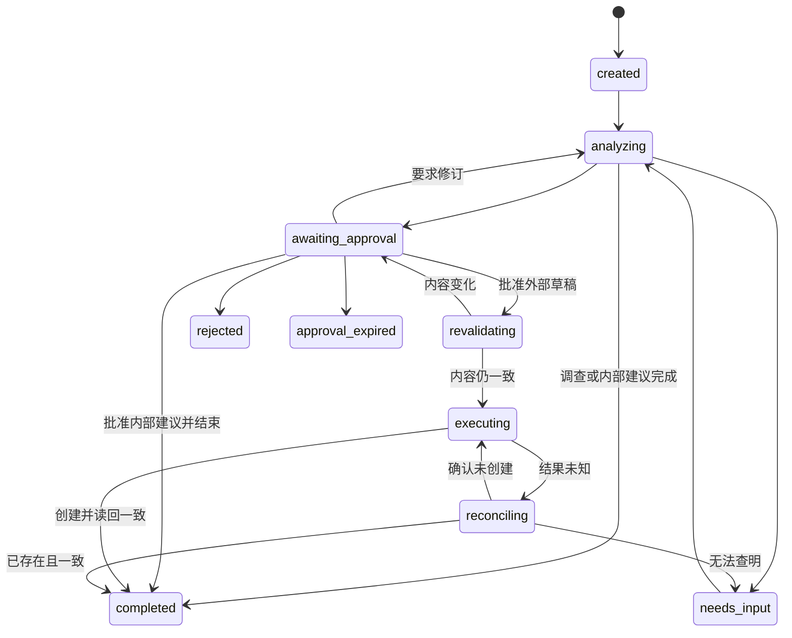

# SupplyAgent Run 状态机

> **文档契约** · 类型：Runtime 状态契约 SSOT · 读取：实现状态流转、等待或恢复时定点读取
> 更新：Run 状态、合法迁移或迁移证据变化时
> 独占：状态、迁移和不变量
> 不收录：节点内部算法、表结构、工具 schema 和执行成绩

Run 状态描述业务生命周期；节点进度、尝试次数和 checkpoint 另行持久化。未列出的状态迁移均非法。PostgreSQL 保存恢复所需事实，Redis 只负责协调。

## 1. 状态

| 状态 | 类别 | 含义 |
|---|---|---|
| `created` | 活动 | Run 已创建，尚未领取执行 |
| `analyzing` | 活动 | 正在执行缺口计算、证据调查或建议节点 |
| `needs_input` | 等待 | 缺字段、证据、身份确认或人工选择 |
| `awaiting_approval` | 等待 | 当前方案版本等待评审 |
| `revalidating` | 活动 | 已批准，写操作前复核方案和业务快照 |
| `executing` | 活动 | 正在创建外部采购草稿 |
| `reconciling` | 活动 | 写入结果未知，正在核对 |
| `completed` | 终态 | 无需外部写入的调查已完成，或草稿已创建并核对 |
| `rejected` | 终态 | 人工拒绝当前任务 |
| `approval_expired` | 终态 | 审批按已配置策略过期 |
| `failed` | 终态 | 不可恢复错误或人工决定终止 |
| `cancelled` | 终态 | 人工取消；不代表外部副作用已经回滚 |

## 2. 迁移图

任一活动态可在错误不可恢复时进入 `failed`；任一非终态可经人工进入 `cancelled`。这两类迁移必须保存原因、已完成节点和可能的外部副作用。

## 3. 迁移证据

| 迁移 | 必备证据 |
|---|---|
| created → analyzing | 输入快照、幂等键、工作流定义版本 |
| analyzing → needs_input | 未解决项、来源节点、已有证据和具体问题 |
| needs_input → analyzing | 操作人、时间、回答或选择、受影响节点 |
| analyzing → awaiting_approval | Proposal 版本、content_hash、计算与 Evidence 引用、未决问题 |
| analyzing → completed | 最终 Artifact、引用完整性检查和完成原因 |
| awaiting_approval → analyzing | 修订意见；新方案必须生成新版本 |
| awaiting_approval → revalidating | PermissionDecision 绑定版本、哈希和动作范围 |
| awaiting_approval → completed | 对当前内部建议的人工决定；无外部写入 |
| revalidating → executing | 重算哈希、业务快照和权限仍一致 |
| revalidating → awaiting_approval | 差异明细；旧决定失效 |
| executing → completed | external_id、logical_action_id、读回比对 |
| executing → reconciling | 已发请求和结果未知证据 |
| reconciling → completed | 目标系统找到唯一且一致的草稿 |
| reconciling → executing | 明确 not_found，复用同一 logical_action_id |
| reconciling → needs_input | 核对为 unknown，禁止盲目重试 |

## 4. Checkpoint 与恢复

每个节点尝试至少保存 run_id、node_id、node_kind、attempt、input_refs、status、started_at、finished_at、result_ref、error 和 next_node。恢复时：

1. 从 PostgreSQL 读取最后一个已提交 checkpoint；
2. 校验其引用的 Evidence、Artifact 与规则版本仍存在；
3. 确定性节点可按相同输入安全重算；
4. 只读工具优先复用仍新鲜的 ToolResult；
5. 模型节点按保存的 ModelCall/Artifact 判定是否需要重试；
6. 写节点只做核对，不直接重发。

Runtime 不依赖模型聊天记录决定从哪里继续。

## 5. 不变量

1. 业务状态与 checkpoint 只以 PostgreSQL 为权威。
2. 终态无出边；后续业务变化创建新 Run 或显式的新版本任务。
3. 外部写入前必须经过 awaiting_approval 和 revalidating。
4. PermissionDecision 只对绑定的方案版本、哈希和动作范围有效。
5. 同一 logical_action_id 最终最多产生一个外部对象。
6. 恢复不重复已经确认的副作用；结果未知先核对。
7. Human Gate 恢复的是同一个 Run，并使受影响的后续产物失效。
8. 自动和人工入口使用同一状态机、权限和证据要求。
9. cancelled 不等于回滚；已经发出的写操作仍须核对。
10. 模型后端切换不改变状态迁移和审批边界。

## 6. 待定项

| 编号 | 待定内容 |
|---|---|
| S-TBD-01 | 审批是否过期及期限；未确定前保持等待 |
| S-TBD-02 | 可恢复错误是复用 analyzing 还是增加 paused 状态 |
| S-TBD-03 | 无外部写入时“批准内部建议并结束”是否为 MVP 必选步骤 |

本文还依赖跨文档未决项 **Q-06**（自动触发来源与活动 Run 去重窗口），正文见 `docs/OPEN-QUESTIONS.md`。
